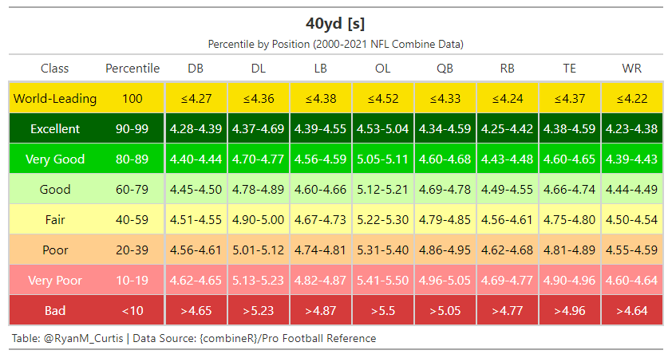
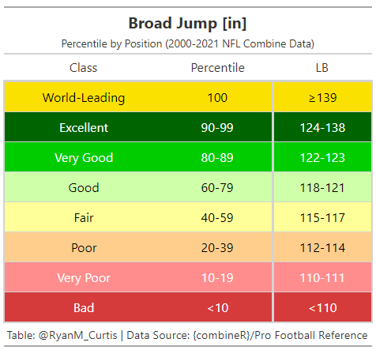

 <!-- badges: start -->
  [](https://opensource.org/licenses/MIT)
  [](https://www.tidyverse.org/lifecycle/#experimental)
  
  <!-- badges: end -->


# {combineR}
An R package for easily gathering and exploring NFL Draft and Combine data.


***

## What is combineR

**{combineR}** is a package developed to easily gather and explore NFL Combine data (2000-current) from [Pro Football Reference](https://www.pro-football-reference.com/) and NFL Draft data (1936-current) from [drafthistory.com](https://drafthistory.com). The aim is to aid sports scientist, performance practitioners and football enthusiasts in developing and refining R skills, as well as, suppport athletic development, research and innovation.

***

## Installation

``` r
#Not yet on CRAN

  
#Install the development version from GitHub  
install.packages("devtools")
devtools::install_github("rmcurtis43/combineR")
```

***

## Version 1.2.1 Update

You can now use the `combine_data()` function to pull the most update combine dataset which includes combine scores, player images, team/conference logos, and lower body power estimations from the broad and vertical jumps (Mann and Sayers equations, respectively). A `draft_data()` function has also been included, which allows the user to gather NFL draft data from 1936-current from [drafthistory.com](https://drafthistory.com). The `pull_combine_data()` function is still available for those who have workflows already in place, it is however recommended to use `combine_data()`. 

***

## `combine_data()`

``` r
library(combineR)

combine_data(start_year = 2021, end_year = 2021)

`
# A tibble: 464 x 30
   player          combine_year draft_year team  conference draft_team designation position
   <chr>                  <dbl>      <dbl> <chr> <chr>      <chr>      <chr>       <chr>   
 1 Trevor Lawrence         2021       2021 Clem~ ACC        Jacksonvi~ Skill       QB      
 2 Zach Wilson             2021       2021 BYU   WCC        New York ~ Skill       QB      
 3 Trey Lance              2021       2021 Nort~ Summit Le~ San Franc~ Skill       QB      
 4 Kyle Pitts              2021       2021 Flor~ SEC        Atlanta F~ Skill       TE      
 5 Ja'Marr Chase           2021       2021 LSU   SEC        Cincinnat~ Skill       WR      
 6 Penei Sewell            2021       2021 Oreg~ Pac-12     Detroit L~ Big         OL      
 7 Jaycee Horn             2021       2021 Sout~ SEC        Carolina ~ Skill       DB      
 8 Patrick Surtain         2021       2021 Alab~ SEC        Denver Br~ Skill       DB      
 9 Justin Fields           2021       2021 Ohio~ Big Ten    Chicago B~ Skill       QB      
10 Micah Parsons           2021       2021 Penn~ Big Ten    Dallas Co~ Skill       LB      
# ... with 454 more rows, and 22 more variables: position2 <chr>, draft_round <dbl>,
#   draft_overall_pick <dbl>, height_in <dbl>, height_ft_in <chr>, weight_lbs <dbl>,
#   weight_kg <dbl>, vertical_in <dbl>, vertical_cm <dbl>, vertical_jump_power_w <dbl>,
#   broad_jump_in <dbl>, broad_jump_cm <dbl>, broad_jump_power_w <dbl>, bench <dbl>,
#   x3cone <dbl>, shuttle <dbl>, x40yd <dbl>, team_color <chr>,
#   team_color_secondary <chr>, player_image <chr>, team_image <chr>,
#   conference_image <chr>
`
```


Or you can enter a start_year (e.g., `2019`) and and end_year (e.g. `2021`) to gather data between user defined seasons. Please note the earliest data available is `2000`.

``` r
library(combineR)

combine_data(start_year = 2019, end_year = 2021)

OR

combine_data(2019, 2021)

`
# A tibble: 1,136 x 30
   player   combine_year draft_year team    conference draft_team  designation position position2
   <chr>           <dbl>      <dbl> <chr>   <chr>      <chr>       <chr>       <chr>    <chr>    
 1 Trevor ~         2021       2021 Clemson ACC        Jacksonvil~ Skill       QB       QB       
 2 Zach Wi~         2021       2021 BYU     WCC        New York J~ Skill       QB       QB       
 3 Trey La~         2021       2021 North ~ Summit Le~ San Franci~ Skill       QB       QB       
 4 Kyle Pi~         2021       2021 Florida SEC        Atlanta Fa~ Skill       TE       TE       
 5 Ja'Marr~         2021       2021 LSU     SEC        Cincinnati~ Skill       WR       WR       
 6 Penei S~         2021       2021 Oregon  Pac-12     Detroit Li~ Big         OL       OL       
 7 Jaycee ~         2021       2021 South ~ SEC        Carolina P~ Skill       DB       DB       
 8 Patrick~         2021       2021 Alabama SEC        Denver Bro~ Skill       DB       DB       
 9 Justin ~         2021       2021 Ohio S~ Big Ten    Chicago Be~ Skill       QB       QB       
10 Micah P~         2021       2021 Penn S~ Big Ten    Dallas Cow~ Skill       LB       LB       
# ... with 1,126 more rows, and 21 more variables: draft_round <dbl>, draft_overall_pick <dbl>,
#   height_in <dbl>, height_ft_in <chr>, weight_lbs <dbl>, weight_kg <dbl>, vertical_in <dbl>,
#   vertical_cm <dbl>, vertical_jump_power_w <dbl>, broad_jump_in <dbl>, broad_jump_cm <dbl>,
#   broad_jump_power_w <dbl>, bench <dbl>, x3cone <dbl>, shuttle <dbl>, x40yd <dbl>,
#   team_color <chr>, team_color_secondary <chr>, player_image <chr>, team_image <chr>,
#   conference_image <chr>
`
```


**Note:** Calling just `combine_data()` returns a tibble of all available data (i.e., 2000-current).


***

## `draft_data()` is available for pulling draft records 1936-current. The inputs and functionality are the same as `draft_data()` (i.e., start_year, end_year)

``` r
library(combineR)

draft_data(start_year = 2019, end_year = 2021)

`
# A tibble: 770 x 11
   draft_year draft_round draft_round_pick draft_overall_pick player  draft_team position team   player_image team_image conference_image 
        <dbl>       <dbl>            <dbl>              <dbl> <chr>   <chr>      <chr>    <chr>  <chr>        <chr>      <chr>            
 1       2021           1                1                  1 Trevor~ Jaguars    QB       Clems~ https://sta~ http://a.~ https://sportslo~
 2       2021           1                2                  2 Zach W~ Jets       QB       Brigh~ http://stat~ http://a.~ https://sportslo~
 3       2021           1                3                  3 Trey L~ 49ers      QB       North~ https://sta~ https://i~ https://upload.w~
 4       2021           1                4                  4 Kyle P~ Falcons    TE       Flori~ https://sta~ http://a.~ https://upload.w~
 5       2021           1                5                  5 Ja'Mar~ Bengals    WR       Louis~ http://stat~ http://a.~ https://upload.w~
 6       2021           1                6                  6 Jaylen~ Dolphins   WR       Alaba~ https://sta~ http://a.~ https://upload.w~
 7       2021           1                7                  7 Penei ~ Lions      T        Oregon https://sta~ http://a.~ https://sportslo~
 8       2021           1                8                  8 Jaycee~ Panthers   DB       South~ https://sta~ http://a.~ https://upload.w~
 9       2021           1                9                  9 Patric~ Broncos    DB       Alaba~ http://stat~ http://a.~ https://upload.w~
10       2021           1               10                 10 DeVont~ Eagles     WR       Alaba~ https://sta~ http://a.~ https://upload.w~
# ... with 760 more rows
`
```

**Note:** Calling just `draft_data()` returns a tibble of all available data (i.e., 1936-current).

***

## You can also still use `pull_combine_data()` for the original dataset with image links


``` r
library(combineR)

pull_combine_data(start_year = 2021, end_year = 2021)

`
# A tibble: 464 x 20
   player draft_year school draft_team draft_round draft_overall_p~ position
   <chr>       <dbl> <chr>  <chr>            <dbl>            <dbl> <chr>   
 1 Trevo~       2021 Clems~ Jacksonvi~           1                1 QB      
 2 Zach ~       2021 BYU    New York ~           1                2 QB      
 3 Trey ~       2021 North~ San Franc~           1                3 QB      
 4 Kyle ~       2021 Flori~ Atlanta F~           1                4 TE      
 5 Ja'Ma~       2021 LSU    Cincinnat~           1                5 WR      
 6 Penei~       2021 Oregon Detroit L~           1                7 OL      
 7 Jayce~       2021 South~ Carolina ~           1                8 DB      
 8 Patri~       2021 Alaba~ Denver Br~           1                9 DB      
 9 Justi~       2021 Ohio ~ Chicago B~           1               11 QB      
10 Micah~       2021 Penn ~ Dallas Co~           1               12 LB      
# ... with 454 more rows, and 13 more variables: position2 <chr>,
#   height_in <dbl>, height_ft_in <chr>, weight_lbs <dbl>, weight_kg <dbl>,
#   vertical_in <dbl>, vertical_cm <dbl>, broad_jump_in <dbl>,
#   broad_jump_cm <dbl>, bench <dbl>, x3cone <dbl>, shuttle <dbl>, x40yd <dbl>
`
```


**Note:** Calling just `pull_combine_data()` returns a tibble of all available data (i.e., 2000-current).


***

## `combine_data()` Dictionary


The current tibble from `combine_data()` has 30 fields:

* player (Player Name, character)
* combine_year (Combine Year, numeric)
* draft_year (Draft Year, numeric)
* team (College Attended, character)
* conference (Conference of college, character)
* draft_team (NFL Draft Team, character)
* designation ("Big", "Skill" or "Special Teams", character)
* position (Position supplid by Pro Football Reference, character)
  -"QB", "DL", "CB", "OL", "LB", "WR", "RB", "S", "TE", "LS", "K", "P", "DB", "DE", "OLB", "OT", "C", "DT", "NT","PK", "FB", "T"
* position2 (Condensed Position Grouping, character)
* draft_round (Round Drafted, numeric)
* draft_overall_pick (Overall Pick in Draft Year, numeric)
  -"QB", "DL", "DB", "OL", "LB", "WR", "RB", "TE", "LS", "PK"
* height_in (Height in inches, numeric)
* height_ft_in (Height in feet and inches, character)
* weight_lbs (Weight in pounds, numeric)
* weight_kg (Weight in kilograms, numeric)
* vertical_in (Vertical Jump Height in inches, numeric)
* vertical_cm (Verical Jump Height in centimeters, numeric)
* vertical_jump_power_w (Verical Jump Power in Watts [Sayers Equation], numeric)
* broad_jump_in (Broad Jump [Standing Long Jump] in inches, numeric)
* broad_jump_cm (Broad Jump [Standing Long Jump] in centimeters, numeric)
* broad_jump_power_w (Broad Jump Power in Watts [mann Equation], numeric)
* bench (Bench Press Reps @ 225 lbs, numeric)
* x3cone (3 Cone Agility Drill in seconds, numeric)
* shuttle (Shuttle Drill in seconds, numeric)
* x40yd (40 yard dash in seconds, numeric)
* team_color (hex code, character)
* team_color_secondary (hex code, character)
* player_image (url link to headshot, character)
* team_image (url link to college team logo, character)
* conference_image (url link to college conference logo, character)


***

## `pull_combine_data()` Dictionary


The current tibble from `pull_combine_data()` has 20 fields:

* player (Player Name, character)
* combine_year (Combine Year, numeric)
* draft_year (Draft Year, numeric)
* school (School Attended, character)
* draft_team (Draft Team, character)
* draft_round (Round Drafted, numeric)
* draft_overall_pick (Overall Pick in Draft Year, numeric)
* position (Position supplid by Pro Football Reference, character)
  -"QB", "DL", "CB", "OL", "LB", "WR", "RB", "S", "TE", "LS", "K", "P", "DB", "DE", "OLB", "OT", "C", "DT", "NT","PK", "FB", "T"
* position2 (Condensed Position Grouping, character)
  -"QB", "DL", "DB", "OL", "LB", "WR", "RB", "TE", "LS", "PK"
* height_in (Height in inches, numeric)
* height_ft_in (Height in feet and inches, character)
* weight_lbs (Weight in pounds, numeric)
* weight_kg (Weight in kilograms, numeric)
* vertical_in (Vertical Jump Height in inches, numeric)
* vertical_cm (Verical Jump Height in centimeters, numeric)
* broad_jump_in (Broad Jump [Standing Long Jump] in inches, numeric)
* broad_jump_cm (Broad Jump [Standing Long Jump] in centimeters, numeric)
* bench (Bench Press Reps @ 225 lbs, numeric)
* x3cone (3 Cone Agility Drill in seconds, numeric)
* shuttle (Shuttle Drill in seconds, numeric)
* x40yd (40 yard dash in seconds, numeric)


***

## `benchmark_table()`


The `benchmark_table()` funtion was written to provide practitioners with practical scores for benchmarking their athletes performance. Benchmarking is critical to the athlete evaluation process as it provides objective feedback as to how an athlete's physical performance or anthropometrics compare to NFL Combine norms.

The function accepts a single test (e.g. test = '40yd'), followed by a list of positions to be included in the table (e.g. positions = c('DB', 'DL', 'LB', 'OL', 'QB', 'RB', 'TE', 'WR')). Please note tests and positions must be wrapped in parentheses, also the 'positions' input requires a string of characters between c() (i.e., indicates a vector of positions to include in the table).

Accepted inputs for **test** include:

* Height
* Weight
* Vertical Jump
* Broad Jump
* Bench
* 3cone
* Shuttle
* 40yd


Accepted inputs for **positions** include any combination of:

* DB
* DL
* LB
* OL
* QB
* RB
* TE
* WR
* PK
* LS


Please see the example below.

```{r}
benchmark_table(test = '40yd', positions = c('DB', 'DL', 'LB', 'OL', 'QB', 'RB', 'TE', 'WR'))
```



You can create a table with a single position as well...
```{r}
benchmark_table(test = 'Broad Jump', positions = c('LB'))
```


***

## Citation

```{r}

citation("combineR")

Curtis, RM. (2021). combineR: An R package to gather NFL Draft Combine data. R package version 0.4.0. https://github.com/rmcurtis43/combineR

A BibTeX entry for LaTeX users is

  @Manual{,
    title = {combineR: An R package to gather NFL Draft Combine data},
    author = {{Ryan Curtis} and email = "rmcurtis43 at yahoo.com")},
    note = {R package version 0.4.0},
    url = {https://github.com/rmcurtis43/combineR},
  }
```


***

**{combineR}** is under development and may change over time.   


***

## Visualizations


You can check out some **{combineR}** visualizations [here](https://github.com/rmcurtis43/combineR-visuals)
